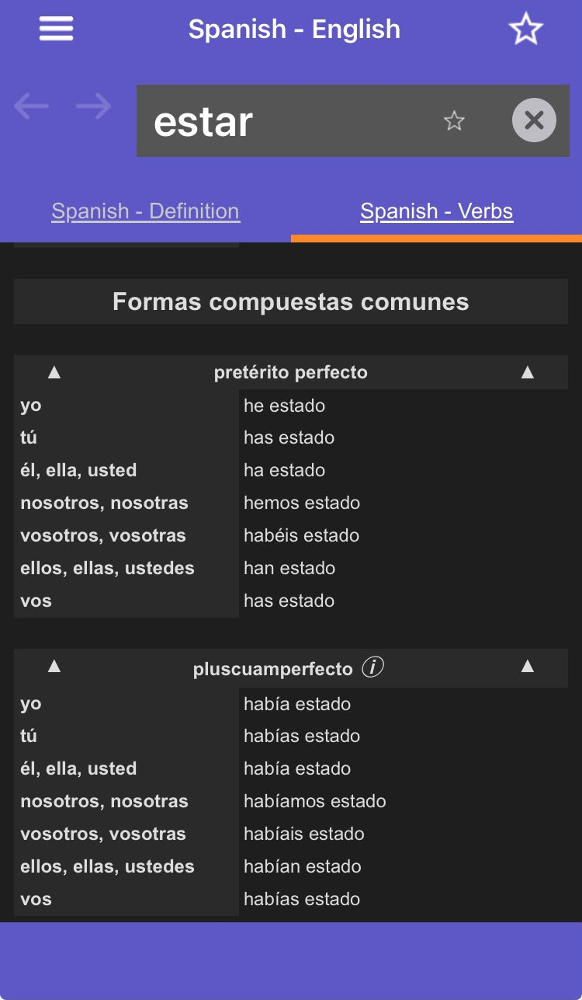
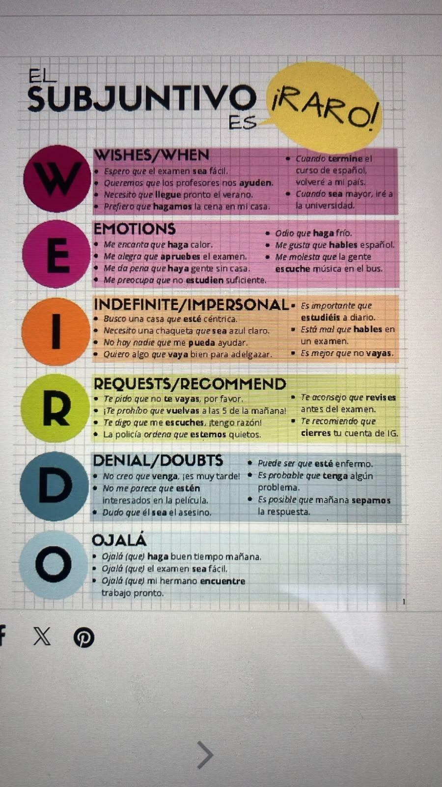

## Sun Augosto 23, 2026

Páginas veintiuno ah ... (libro expanola) o diecisiete ah .. (suramericano).

### Plabras y fraces para recorder

| palabra o frace | meaning in english |
| :--- | :--- |
| He estado evitando su compania... | He has been avoiding my company... |
| nos viciamos con la consola (viciarse) | Lets get hooked on some videogames |
| Creo que Ronley me pareció tan patético que decidí tomarlo bajo mi protección. | I think Rowley struck me as so pathetic that I decided to take him under my protection. |
| Lo hemos pasado bien juntos, sobre todo porque me he acostumbrado a hacerle caer en las mismas bromas que me gasta Rodrick. | We had a good time together, especially because I've gotten into the habit of playing the same pranks on him what Rodrick puts me through. |
| Jamas le cae un broncazo, qunque se lo merezca. | He never gets into trouble, even when he deserves it. |
| Pensé que esta vez si que se la habia cargado y que papà y mamà lo aiban a castigar. | I thought that this time he had really messed up and that Mom and Dad were going to punish him. |
| | |

